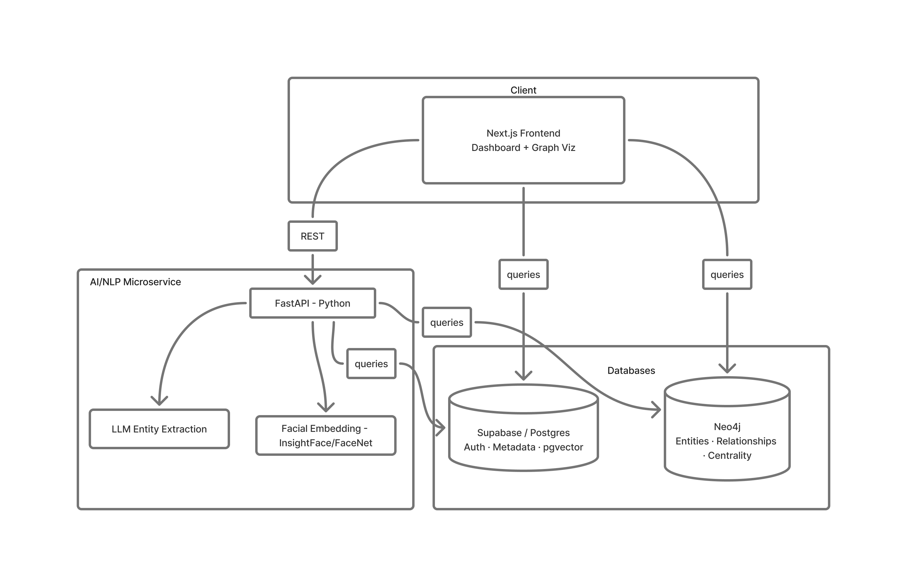

# Netra

**AI-Powered Criminal Network Analysis System**

*Built for Smart India Hackathon — addressing NCRB Problem Statement #26189*
*Ministry of Home Affairs · National Crime Records Bureau · Women Safety Division*


---

## Overview

Modern criminal activity is networked — suspects, phones, bank accounts, vehicles, and
locations are all connected, but that evidence sits fragmented across FIRs, call records,
financial logs, and surveillance reports. Investigators can be sitting on the exact data
needed to connect two "unrelated" cases and never see it.

Netra ingests raw, messy case evidence and automatically:

- Extracts entities (people, phones, accounts, vehicles, locations) from unstructured text
- Builds a knowledge graph connecting them across cases
- Identifies key influencers using network centrality analysis
- Flags suspicious patterns — circular transfers, high-frequency short calls
- Matches faces across every case in the system
- Updates live as new field intelligence comes in
- Exports findings into a court/briefing-ready report

Most individual case files, read in isolation, look unrelated to one another. Netra's
purpose is to find the ones that aren't.

---

## Architecture



Postgres handles rows, auth, and vector similarity search. Neo4j handles relationship
traversal and graph algorithms — centrality, pattern detection. Neo4j is the single
source of truth for entities and relationships; Postgres never duplicates that data,
only references it by ID.

---

## Dataset & Methodology

Real FIR, CDR, and financial data is legally restricted and inaccessible for a hackathon
build (as noted in the problem statement itself), so Netra's demo runs entirely on
purpose-built synthetic data — designed to be structurally realistic, not randomly
generated.

**How the dataset is built:**
- A master network of **114 fictional people** across **6 criminal hubs**, each with
  phones, vehicles, bank accounts, and organizational ties, modeled on the **POLE+O**
  ontology (Person, Object, Location, Event, Organization) — an established framework
  used in real law-enforcement intelligence analysis.
- **200 individual case files**, deliberately split across three tiers (basic, moderate,
  high-value) to mirror how real casework is distributed — most cases are small and
  look unrelated; only a subset are large and richly connected.
- **12 "bridge" individuals** are deliberately planted to connect otherwise-separate
  criminal hubs — through a shared phone, bank account, vehicle, or associate — so
  that a meaningful number of the 200 cases are secretly linked, exactly the kind of
  hidden connection Netra is built to surface.
- Every dataset component (FIR narratives, call detail records, financial transactions,
  suspect photos) is generated from this same underlying network, so names, numbers,
  and accounts stay consistent across every file rather than being independently
  randomized.
- The full pipeline includes an automated validation script that checks manifest
  integrity, entity references, tier rules, bridge consistency, and file completeness
  end-to-end — the dataset is verified internally consistent, not just assumed to be.

This design means the demo doesn't just show a system that *could* work — it can prove,
on request, that a specific planted connection between two "unrelated" cases was
actually found by the system, not staged after the fact.

---

## Build Progress


| Segment | Working On It | Notes |
|---|---|---|
| Planning & App Flow | Team | Done |
| UI/UX Mockups | Sohan Darde | Done |
| Data Generation | Rishikesh Dhamdhere | Complete: master graph, manifest, FIR/CDR/financial data, photos, JSON exports, and automated validation all built and verified |
| Database (Neo4j + Supabase) | Tanmay Madhavi | Not started |
| AI/NLP Backend | Rohan Ayare & Taswi Tawde | FastAPI upload endpoint + Gemini extraction worker initialized |
| Frontend | Shubham Jadhav | React Flow knowledge graph UI initialized |
| Integration & Demo Prep | Taswi Tawde | Not started |

Update the badge percentages as work progresses — red under 30%, yellow 30–79%, green
80% and above. Each badge is just a URL, so editing the number is a one-line change:

```
https://img.shields.io/badge/Data%20Generation-100%25-brightgreen
                                    ^label      ^%    ^color
```

---

## Repo Structure

```
netra/
├── frontend/     → Next.js dashboard
├── backend/      → FastAPI AI/NLP microservice
├── data/         → dummy data generators, case manifest, raw files
├── db/           → Neo4j schema/seed scripts, Supabase migrations
├── docs/         → project reference docs + diagrams
└── scripts/      → setup/dev utilities
```

---

## Tech Stack

| Layer | Technology |
|---|---|
| Frontend | Next.js (App Router), TypeScript, Tailwind, Cytoscape.js |
| AI/NLP Backend | Python, FastAPI, LLM APIs |
| Structured Data & Auth | Supabase (Postgres + pgvector) |
| Graph Database | Neo4j (+ Graph Data Science library for centrality) |
| Facial Recognition | InsightFace / FaceNet |

---

## Research & Reading List

The techniques behind Netra draw on established work in criminal network analysis,
graph-based financial crime detection, and legal-text NLP.

**Network analysis & key player detection**
- Duijn & Klerks et al. — [Using social network analysis to target criminal networks](https://www.researchgate.net/publication/225788132_Using_social_network_analysis_to_target_criminal_networks) — extends Borgatti's key-player approach with weighted actors and relationships, directly relevant to our centrality/influencer ranking.
- [Covert Network Analysis for Key Player Detection and Event Prediction Using a Hybrid Classifier](https://www.ncbi.nlm.nih.gov/pmc/articles/PMC4127216/) — centrality-based key player detection combined with outlier/anomaly detection.
- [Social network analysis as a tool for criminal intelligence](https://www.researchgate.net/publication/318037428_Social_network_analysis_as_a_tool_for_criminal_intelligence_Understanding_its_potential_from_the_perspectives_of_intelligence_analysts) — practitioner-facing view of how real analysts use SNA to find overlooked connections.
- [The Game is the Game: Dynamic network analysis and shifting roles in criminal networks](https://www.researchgate.net/publication/349440215_Using_social_network_analysis_to_study_crime_Navigating_the_challenges_of_criminal_justice_records) (2025 preprint) — introduces time as a variable in key-player identification, relevant to our timeline/incident-history view.

**Graph-based financial crime detection**
- [Graph Neural Networks for Financial Fraud Detection: A Review](https://arxiv.org/pdf/2411.05815) — survey of GNN approaches to AML.
- [Finding Money Launderers Using Heterogeneous Graph Neural Networks](https://arxiv.org/abs/2307.13499) — GNN approach applied to real bank transaction data, relevant to our suspicious-transaction-pattern detection.

**NLP entity extraction from legal/police text**
- [Named Entity Recognition and Resolution in Legal Text](https://www.researchgate.net/publication/220745968_Named_Entity_Recognition_and_Resolution_in_Legal_Text) — foundational approach to extracting and resolving named entities from legal documents.
- [Named Entity Recognition in Indian court judgments](https://huggingface.co/opennyaiorg/en_legal_ner_trf) (Kalamkar et al., 2022) — Indian-context legal NER model and dataset, directly applicable to FIR-style text.
- [Named-Entity Recognition for Portuguese Police Reports](https://www.dcc.fc.up.pt/~mantunes/papers/jiue2018.pdf) — one of the few papers specifically on extracting entities from police report text rather than generic documents.

---

## Future Scope

- Integration with real case-management systems, pending appropriate inter-agency data
  sharing agreements and compliance review
- Multi-language FIR support, given first-information reports are frequently filed in
  regional languages rather than English
- A lightweight field-officer mobile companion for on-the-ground lead submission
- Expanded facial recognition to handle low-quality CCTV footage, not just clear photos
- Audit logging and chain-of-custody tracking, required for any evidence used in
  actual court proceedings

---

## Getting Started

*(to be filled in as each part comes online)*

---

*Built for Smart India Hackathon, [Dates TBD]*